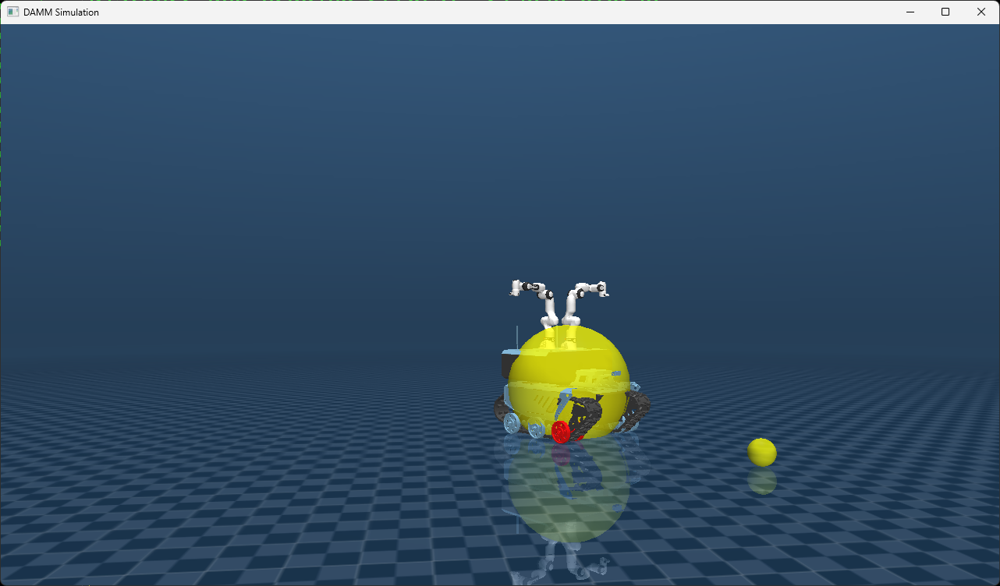

# SSMM
Skid Steer Mobile Manipulator (SSMM) Modeling in MuJoCo.

Model and simulate a dual-arm mobile manipulator (DAMM).
 
Arms:        Franka Research 3 (FR3) by Franka Emika
Mobile base: Bunker by Agilex

The model information is contained in the XML model files.

The simulation of the DAMM illustrates how to implement a 
motion controller to drive the mobile base to a target position,
while simultaneously controlling the arms with a simple joint
PD controller. More information about the controllers is contained
in the code comments. The arms and base controllers can be replaced
by more advanced controllers, e.g. optimal controllers in the
operational space.

Requires Python 3.x, MuJoCo 3.1.3, OpenGL.

Version 1.0  - 2025.02.03 

*Copyright (c) 2025 Miguel Torres-Torriti under MIT License. See LICENSE.txt file.*

*Source: https://github.com/RAL-UC/SSMM*

---

---
## GENERAL DESCRIPTION OF THE DUAL-ARM MOBILE MANIPULATOR MuJoCo MODEL 

FR3 arms employ the model in MuJoCo Menangerie:
   https://github.com/google-deepmind/mujoco_menagerie/tree/main/franka_fr3,
which is derived from the publicly available URDF description available at:
   https://github.com/frankaemika/franka_description.
 
An older model of the arms, based on the Panda Arm (or Franka Emika Robot FER), which
includes the Franka Hand can be found at:
   https://github.com/vikashplus/franka_sim.

The mobile base model is derived from the Agilex Robotics description found at:
   https://github.com/agilexrobotics/ugv_gazebo_sim/tree/master/bunker/bunker_description

- The Dual-Arm Mobile Manipulator Model inherits settings from the FR3 and Bunker 
  Mujoco models.
- The accuracy of the original model parameters has not been verified.
- The model descriptions and assets are contained in folders:

             ../assets/FR3, ../assets/agilex_bunker
	 
- To use the assests in "../assets/.." the following MuJoCo compiler option was included:

             '<compiler ... meshdir="assets" ... />'
	
- The main model file is DAMM1.xml, and the model was divided into subfiles:

            Mobile Base: <include file='assets/agilex_bunker/agilex_bunker_body.xml'/>
	 
              Arm 1: <include file="assets/FR3/FR3_body.xml"/>
			  
              Arm 2: <include file="assets/FR3/FR3_body_2.xml"/>
			  
- To change the position of the arms on the mobile base, simply update the posistion 
  specification in the lines below:
    
             <body name="arm_base_1" childclass="fr3" pos="0.05 0 0.42">
             <body name="arm_base_2" childclass="fr3" pos="-0.3 0 0.42">
   
   Note, the current configuration has one arm in front and the other at the rear of the 
   mobile base.

- Actuators are all specified as motors, and are contained in the corresponding assets 
  subdirectories:
  
             <include file='assets/agilex_bunker/agilex_bunker_actuators.xml'/>
	 
             <include file='assets/FR3/FR3_actuators.xml'/>
	 
             <include file='assets/FR3/FR3_actuators_2.xml'/> 
	 
 
- The model does not include sensors nor other settings.  The goal was to keep it as simple as possible. 

---
## RUNNING THE MODEL

Simply execute **sim_damm.py** from the terminal.

To visualize the MuJoCo model in the XML file simply drag-and-drop the **DAMM1.XML** file onto the MuJoCo's `simulate` user-interface.

*A short tutorial on MuJoCo's XML file for model description can be found in file [L03_tutorial_mujoco.pdf](L03_tutorial_mujoco.pdf).*

---

